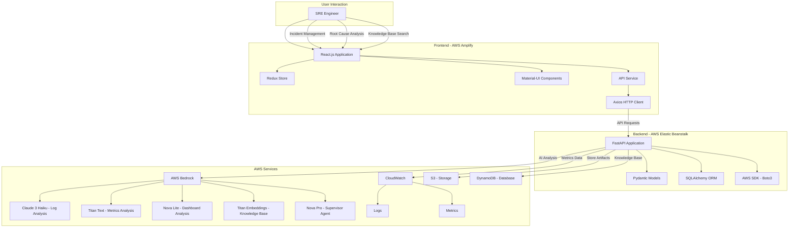

# SRE Copilot Enhanced


[](https://opensource.org/licenses/MIT)
[](https://reactjs.org/)
[](https://fastapi.tiangolo.com/)
[](https://aws.amazon.com/bedrock/)

SRE Copilot Enhanced is an AI-powered solution for root cause analysis and incident management, designed to help Site Reliability Engineers (SREs) quickly identify and resolve issues in cloud environments. This enhanced version features a modern React.js frontend deployed to AWS Amplify and a FastAPI backend deployed to AWS Elastic Beanstalk, providing a complete end-to-end solution.

## Architecture

The SRE Copilot Enhanced follows a modern microservices architecture with a React.js frontend deployed to AWS Amplify and a FastAPI backend deployed to AWS Elastic Beanstalk.



### System Components

#### Frontend (React.js + AWS Amplify)
- **React.js**: Modern UI framework with TypeScript for type safety
- **Redux Toolkit**: State management
- **Material-UI**: Component library for consistent design
- **Axios**: API client for backend communication
- **Chart.js**: Data visualization

The frontend code is located in the `frontend/` directory of this repository.

#### Backend (FastAPI + AWS Elastic Beanstalk)
- **FastAPI**: Modern, high-performance Python web framework
- **Pydantic**: Data validation and settings management
- **SQLAlchemy**: ORM for database interactions
- **AWS SDK (Boto3)**: AWS service integrations
- **Docker**: Containerization

The backend code is located in the `backend/` directory of this repository.

#### AWS Integration
- **AWS Bedrock**: Foundation models for AI-powered analysis
  - Claude 3 Haiku: Log analysis
  - Amazon Titan Text: Metrics analysis
  - Amazon Nova Lite: Dashboard analysis
  - Amazon Titan Embeddings: Knowledge base
  - Amazon Nova Pro: Supervisor agent
- **CloudWatch**: Logs and metrics
- **S3**: Storage for analysis artifacts
- **DynamoDB**: Knowledge base storage

## Features

- **Incident Management**: Create, track, and resolve incidents
- **Multi-Modal Analysis**: Analyze logs, metrics, and dashboard data
- **AI-Powered Root Cause Identification**: Leverage AWS Bedrock foundation models
- **Knowledge Base**: Store and retrieve past incidents and resolutions
- **Real-time Monitoring**: Track system status and metrics

## Repository Structure

```
sre-copilot-enhanced/
├── frontend/                # React.js frontend application
│   ├── src/                 # Source code
│   │   ├── components/      # Reusable UI components
│   │   ├── pages/           # Page components
│   │   ├── services/        # API services
│   │   ├── store/           # Redux store
│   │   ├── utils/           # Utility functions
│   │   └── types/           # TypeScript type definitions
│   ├── package.json         # Frontend dependencies
│   ├── tsconfig.json        # TypeScript configuration
│   └── amplify.yml          # AWS Amplify configuration
├── backend/                 # FastAPI backend application
│   ├── main.py              # Main application entry point
│   ├── requirements.txt     # Python dependencies
│   ├── Dockerfile           # Docker configuration
│   └── .ebextensions/       # Elastic Beanstalk configuration
├── docs/                    # Documentation
│   ├── architecture-diagram.mmd  # Mermaid diagram source
│   └── architecture-diagram.dot  # GraphViz diagram source
├── test_end_to_end.py       # End-to-end testing script
├── documentation.md         # Detailed documentation
├── LICENSE                  # MIT License
└── README.md                # This file
```

## Deployment Instructions

### Prerequisites

- AWS Account with access to:
  - AWS Amplify
  - AWS Elastic Beanstalk
  - AWS Bedrock
  - AWS CloudWatch
  - AWS S3
  - AWS DynamoDB
- GitHub account for repository hosting
- Docker installed locally for testing

### Frontend Deployment (AWS Amplify)

1. **Connect Repository to AWS Amplify**

   ```bash
   # Navigate to AWS Amplify Console
   # Select "Host web app" > "GitHub" > Connect repository
   # Select the repository and branch
   ```

2. **Configure Build Settings**

   Use the provided `amplify.yml` file in the frontend directory:

   ```yaml
   version: 1
   frontend:
     phases:
       preBuild:
         commands:
           - npm ci
       build:
         commands:
           - echo "REACT_APP_API_BASE_URL=$API_BASE_URL" >> .env
           - npm run build
     artifacts:
       baseDirectory: build
       files:
         - '**/*'
     cache:
       paths:
         - node_modules/**/*
         - .npm/**/*
   ```

3. **Set Environment Variables**

   In the AWS Amplify Console, add the following environment variables:
   - `API_BASE_URL`: URL of your Elastic Beanstalk backend (e.g., `https://your-eb-environment.elasticbeanstalk.com`)

4. **Deploy the Application**

   Click "Save and deploy" to start the deployment process.

### Backend Deployment (AWS Elastic Beanstalk)

1. **Create Elastic Beanstalk Application**

   ```bash
   # Navigate to AWS Elastic Beanstalk Console
   # Create a new application
   # Create a new environment: Web server environment
   ```

2. **Configure Environment**

   - Platform: Docker
   - Application code: Upload your code (zip the backend directory)

3. **Set Environment Variables**

   In the AWS Elastic Beanstalk Console, add the following environment variables:
   - `ENVIRONMENT`: `production`
   - `LOG_LEVEL`: `INFO`
   - `AWS_REGION`: Your AWS region
   - `AWS_ACCESS_KEY_ID`: Your AWS access key
   - `AWS_SECRET_ACCESS_KEY`: Your AWS secret key
   - `BEDROCK_ENDPOINT`: AWS Bedrock endpoint for your region

4. **Deploy the Application**

   Click "Create environment" to start the deployment process.

### AWS Bedrock Setup

1. **Enable Foundation Models**

   In the AWS Bedrock Console, enable the following foundation models:
   - Claude 3 Haiku
   - Amazon Titan Text
   - Amazon Nova Lite
   - Amazon Titan Embeddings
   - Amazon Nova Pro

2. **Create IAM Role**

   Create an IAM role with the following permissions:
   - `bedrock:InvokeModel`
   - `bedrock:InvokeModelWithResponseStream`
   - `cloudwatch:GetMetricData`
   - `cloudwatch:PutMetricData`
   - `s3:GetObject`
   - `s3:PutObject`
   - `dynamodb:GetItem`
   - `dynamodb:PutItem`
   - `dynamodb:Query`
   - `dynamodb:Scan`

3. **Attach IAM Role to Elastic Beanstalk**

   In the AWS Elastic Beanstalk Console, attach the IAM role to your environment.

## Local Development

### Frontend Development

1. **Setup**

   ```bash
   cd frontend
   npm install
   ```

2. **Environment Configuration**

   Create a `.env` file in the frontend directory:
   ```
   REACT_APP_API_BASE_URL=http://localhost:8000
   ```

3. **Run Development Server**

   ```bash
   npm start
   ```

### Backend Development

1. **Setup**

   ```bash
   cd backend
   python -m venv venv
   source venv/bin/activate  # On Windows: venv\Scripts\activate
   pip install -r requirements.txt
   ```

2. **Environment Configuration**

   Create a `.env` file in the backend directory:
   ```
   ENVIRONMENT=development
   LOG_LEVEL=DEBUG
   ```

3. **Run Development Server**

   ```bash
   uvicorn main:app --reload
   ```

## Testing

Run the end-to-end test script to verify functionality:

```bash
python test_end_to_end.py
```

This script tests all components of the SRE Copilot Enhanced solution, including:
- Backend API endpoints
- Frontend-backend integration
- AWS service integrations
- Deployment configurations

## Contributing

1. Fork the repository
2. Create a feature branch: `git checkout -b feature/your-feature-name`
3. Commit your changes: `git commit -am 'Add some feature'`
4. Push to the branch: `git push origin feature/your-feature-name`
5. Submit a pull request

## License

This project is licensed under the MIT License - see the [LICENSE](LICENSE) file for details.

## Acknowledgments

- AWS Bedrock foundation models for AI capabilities
- FastAPI for the high-performance backend framework
- React.js for the modern frontend framework
